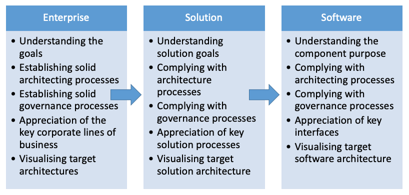

# Enterprise Architecture Team

## What is architecture?

Architecture can be defined as:

> Documentation describing the structure (components) and behaviour (processes) of a system. A detailed plan to guide its implementation.
{:class="blockquote"}

or

> The process for describing the architecture of a system to meet given requirements and under given constraints.
{:class="blockquote"}

### Architecture granularity

Architecture is normally considered at the following levels of increasing detail:

### Enterprise architect goals

- Improved alignment of business and IT
- Improved IT cost-effectiveness
- Business agility
- Technical agility
- Long-term planning
- Vendor and technology independence
- De-duplication of applications and technologies
- Interoperability of applications and technologies
- Simpler systems and systems management
- Improved procurement

### Solution architect goals

- Timeliness of IS/IT project deliverables
- Cost of IS/IT project deliverables
- Quality of IS/IT project deliverables
- Solution-level risk identification and mitigation
- Application integration and integrity
- Conformance to non-functional and audit requirements
- Conformance to principles, standards and legislation
- Effective interaction between managers and technologists
- Governance of detailed design to architecture principles and standards

### Architecture domains

Architecture consists of four primary domains:

{:class="table table-striped table-bordered"}
| Name | Description |
| --- | --- |
| Business  | Functions, capabilities, processes and people |
| Data | Information, data, storage and movement |
| Applications | Application functionality, structure and behaviour |
| Technology   | Application functionality, structure and behaviour of technology platform |

**Security Architecture** is increasingly being recognised as a domain in its own right also.

## What the team does
The team facilitates and supports the delivery of digital services that enable the transformation of the business of Government; it is described more fully in our [Business Model Canvas](business-model-canvas).

## How do we do it?
We do it by:
- recognising the problems our customers are facing
- understanding our customer's aims, objectives and ambition
- baselining the current state
- creating a target architecture
- creating a roadmap to the desired end state

We use various industry standard approaches and in doing so help to ensure that proposed solutions:
- align with applicable NICS strategies
- adhere to NICS architecture principles and standards
- provide the desired business outcomes

Where we are not responsible for the delivery of architecture artefacts we can help to ensure that solutions being proposed by delivery partners undergo the same level of scrutiny as those produced internally.

## What we are working on

We are working on the implementation of the [Citizen Services Architecture Roadmap](https://docs.ea.digitalni.gov.uk/#roadmap). In Q3 2019 we are working specifically on the following Phase 1 initiatives:
- [API Management](initiatives/phase-one/api-management)
- [Documentation and configuration repository](initiatives/phase-one/documentation-config-repo)
- [Usage Tracking Service](initiatives/phase-one/usage-tracking-service)

## How to request architecture work

You should send a [Request for Architecture Work][1] to the [EA Team][2].

[1]: https://ea-team.digitalni.gov.uk/request-for-architecture-work
[2]: mailto:ea-team@ea.finance-ni.gov.uk
